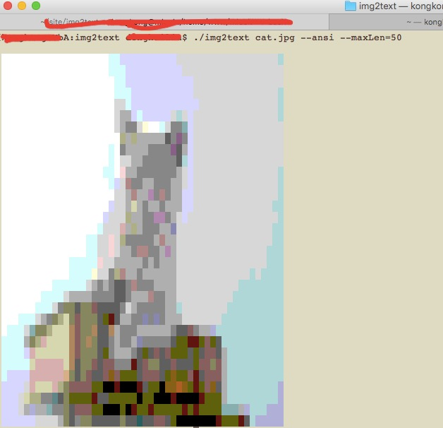

img2text
=======

Image to Ascii Text, can output to html or ansi terminal.
See also [img2text](https://github.com/dhlwing/gif2text)


Example
-------


1. `img2text cat.jpg --color > with-color.html` [demo](http://dhlwing.github.io/img2text/color.html)
2. `img2text cat.jpg > without-color.html` [demo](http://dhlwing.github.io/img2text/nocolor.html)
3. `img2text cat.jpg --ansi`
It would be like this:


Installation
------------

```bash
$ composer require bigweb/img2text
```

Usage
-----

```
Usage:
  img2text <imgfile> [--maxLen=<n>] [--fontSize=<n>] [--color] [--ansi] [--bgcolor=<#RRGGBB>]
  img2text (-h | --help)

Options:
  -h --help             show this screen.
  --ansi                output an ANSI rendering of the image
  --color               output a colored HTML rendering of the image.
  --fontSize=<n>        sets font size (in pixels) when outputting HTML,
                        default: 7
  --maxLen=<n>          resize image so that larger of width or height matches
                        maxLen, default: 100px
  --bgcolor=<#RRGGBB>   if specified, is blended with transparent pixels to
                        produce the output. In ansi case, if no bgcolor set, a
                        fully transparent pixel is not drawn at all, partially
                        transparent pixels drawn as if opaque
```

You also can use it anywhere what you want at your application like this:

```php
use Bigweb\Img2text\Img2text;

$options = [
        'ansi'     => ,
        'color'    => 1,
        'fontSize' => 7,
        'maxLen'   => 100,
    ];
$img = new Img2text('imageFilePath', $options);
echo $img->render();
```

Thanks
------
1. Use https://github.com/docopt/docopt.php to create beautiful command-line interface
2. Use https://github.com/Intervention/image to process image
3. Thanks @hit9, This project stolen from  https://github.com/hit9/img2txt

License
-------

BSD.
